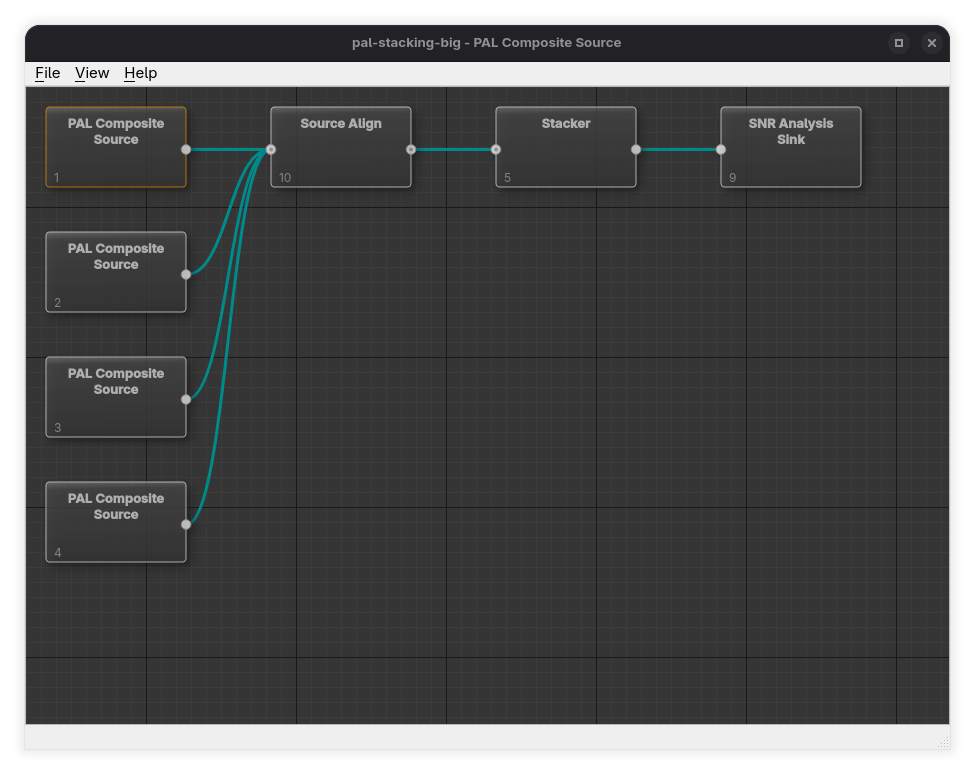

# Main window

The Orc-GUI main window contains:

* A **menu bar** (File / View / Tools / Help)
* A **toolbar** with quick-access buttons for common actions
* A central **processing graph editor** where you build your pipeline using **stages** and **connections**
* A **status bar** that shows short messages about what the application is doing

---

## Toolbar

Directly beneath the menu bar is a toolbar with buttons for the most common actions. Each button mirrors a menu item, so the menus remain available as well.

| Button | Does the same as | Notes |
|--------|------------------|-------|
| Arrange to grid | **View → Arrange DAG to Grid** | Tidies the graph into a left-to-right grid. |
| Show preview | **View → Show Preview** | Opens the Preview window, or brings it to the front if it is already open. Disabled until a project is loaded. |
| Reload all sources | **File → Reload All Sources** | Re-reads every source in the project from disk. Disabled until the project contains a source stage. |
| Theme | **Tools → Themes** | A single button that cycles the theme in the order **Auto → Light → Dark**. Its icon shows the current mode — a half-disc for Auto, a sun for Light, and a crescent moon for Dark — and stays in sync with the Tools → Themes submenu. |

You can hide or show the toolbar with **View → Show Toolbar**.

---

## Menu Bar

### File Menu

#### New Project…

Creates a new, empty project.

When you choose **File → New Project…**, Orc-GUI asks you to select a project type:

* NTSC Composite
* NTSC YC
* PAL Composite
* PAL YC
* PAL-M Composite
* PAL-M YC

You can also choose the project's amplitude display unit (IRE, millivolts, or 10-bit samples; the default is 10-bit samples), which is used by dialogs such as the Line Scope.

A new project starts with an empty graph (no stages are added automatically). You add stages yourself in the graph editor.

#### Quick Project…

Creates a ready-to-run starter project from an existing capture.

When you choose **File → Quick Project…**, Orc-GUI asks you to select a video file:

* `.tbc` (composite TBC)
* `.tbcc` / `.tbcy` (YC TBC; requires both files as a pair)
* `.cvbs` (composite CVBS)
* `.cvbsy` / `.cvbsc` (YC CVBS; requires both files as a pair)

Orc-GUI then looks for the associated metadata alongside the file:

* `<base>.tbc.db` for TBC captures (legacy `<base>.tbc.json` metadata is accepted with a warning)
* `<base>.meta` for CVBS captures

If the metadata file is missing, the quick project cannot be created.

What Quick Project sets up for you:

* Detects whether the capture is **PAL**, **NTSC**, or **PAL-M** from the metadata
* Adds the appropriate **source stage** for the detected system and input type
* Reads the **decoder** recorded in the metadata and builds the pipeline to match:

  * **ld-decode** sources get a **Dropout Correction** stage between the source and the **Video Sink** (`source → dropout correction → video sink`). When the source has an EFM sidecar, an **EFM Decoder Sink** is also added and fed from the Dropout Correction stage's output.
  * **All other** sources (for example vhs-decode) are connected straight from the source stage to the **Video Sink** stage. Captures with only legacy JSON (`.tbc.json`) metadata carry no reliable decoder identity and are always treated as non-ld-decode.
* Adds a **Video Sink** stage (FFmpeg output mode by default)
* If found, automatically attaches optional files next to the capture:

  * `<base>.pcm`
  * `<base>.efm`

After creating a quick project, you should usually:

* Open **Stage Parameters** on the Video Sink stage to set the output path and mode, or use its **FFmpeg Preset Config** stage tool to apply an export preset
* Use **File → Save Project As…** to save the new project (quick projects start “unsaved”)

#### Open Project…

Opens an existing `.orcprj` project file.

#### Save Project

Saves the current project.

If the project has never been saved before, Orc-GUI will prompt you to use **Save Project As…**.

#### Save Project As…

Saves the current project under a new filename.

#### Edit Project…

Edits project-level details (such as name/description). This is enabled only when a project is loaded.

#### Reload All Sources

Re-reads every source stage in the project from disk (**Ctrl+R**).

Use this when the capture behind the project has changed since you opened it — for example when it is still being written by a decoder, or when you have re-run a decode over the same file. Reloading rebuilds the pipeline from the project, so every source stage reopens its media and re-reads its metadata, and the preview picks up the new frame count.

Nothing in the project is changed: the graph, the stage parameters and the modified flag are all left as they are. This is the same refresh a stage parameter dialogue's **Update** button performs, applied to every source at once instead of one at a time.

The action works while any non-modal Orc-GUI window has focus, including the Preview window, and is greyed out until the project contains at least one source stage. It is also available as the circular-arrow button on the toolbar.

Because the rebuild replaces every stage object, open analysis and catalogue result windows are closed and preview playback is stopped — trigger the stage again to refill them.

#### Quit

Exits the application.

---

### View Menu

#### Show Preview

Opens the Preview window (if a project is loaded), or brings it to the front if it is already open. This is where you can view decoded output for the currently selected stage.

#### Show Preview on Selection

A toggle.

When enabled, Orc-GUI automatically shows the Preview window when you select a stage in the graph editor.

#### Arrange DAG to Grid

Automatically lays out the graph in a tidy left-to-right grid based on stage order.

Use this when your graph becomes messy after adding or moving stages.

#### Show Toolbar

A toggle that hides or shows the toolbar beneath the menu bar.

---

### Tools Menu

#### Plugin Manager…

Opens the Plugin Manager, which lists your **installed plugins** — the registered stage plugins — and lets you add, browse for, remove, update, enable, and disable them. `orc-cli plugins` does the same things from a script, on the same registry file; each action below names its command-line equivalent.

The table has one row per plugin, with columns **ID**, **Path**, **Version**, **Update**, **Source** and **Enabled**. The registry file being edited is shown above the table.

* **Add Plugin…** registers a new plugin, either from a local plugin file or from a GitHub releases URL. Remote plugins are downloaded automatically. Adding a plugin is your consent for it to run: plugin binaries execute as native code, so only add plugins from sources you trust. CLI: `orc-cli plugins add <path>` or `orc-cli plugins add --url <releases-url>`.
* **Browse Plugins…** opens the [Browse Plugins](#browse-plugins) dialog, which lists the **available plugins** in the curated index and installs one for you. CLI: `orc-cli plugins search` and `orc-cli plugins install <id>`.
* **Remove** deletes the selected plugin from the registry (core plugins cannot be removed). CLI: `orc-cli plugins remove <selector>`, or `orc-cli plugins remove --dry-run <selector>` to see which entry would go without writing anything.
* **Update** re-fetches the selected plugin from its latest published release. It is enabled only for a row whose **Update** column reports one. A new binary is a new consent, so the update asks you to confirm trust again before it is downloaded. CLI: `orc-cli plugins update <selector>`, or `orc-cli plugins update --all`.
* The **Enabled** checkbox shows whether a plugin will load at the next application start. Entries that arrived from outside Orc-GUI (a hand-edited registry file, `orc-cli plugins install`, or a newly downloaded update you have not confirmed) appear unchecked; ticking the box asks you to confirm that the plugin may run, then enables it. CLI: `orc-cli plugins enable <selector>` and `orc-cli plugins disable <selector>`.
* **Show core plugins** is unticked by default, so the list shows only the plugins you installed yourself. Tick it to also see the plugins that ship with the application — the **core plugins**. CLI: `orc-cli plugins list`, and `orc-cli plugins list --core` to include them.

The **Update** column is filled in by a check that runs in the background when the dialog opens; until it finishes, entries read **Checking...**. An entry then reads **Up to date**, **Update available (version)**, **Unreachable** when the release could not be fetched, or **—** for a plugin with no upstream repository to check. CLI: `orc-cli plugins updates`, or `orc-cli plugins list --check-updates`.

##### Details

The **Details** pane beside the table describes the selected plugin: its selector, its id when that differs, the installed version, the latest published version and update status once the background check has answered, license, source, path, whether the binary exists and is loaded, the ABI it needs against the ABI this build provides, and its status. A field with nothing to report is left out. The same fields, in the same order and with the same labels, are what `orc-cli plugins info <selector>` prints.

A **selector** is how both front ends name one entry: the plugin's id when it has one, and otherwise a `path:` or `url:` handle. Whatever the pane shows, the command line accepts unchanged.

**Status** is the single answer to "will this load?". It reads **Enabled** when the plugin will load at the next launch, and otherwise names the one reason it will not:

* **Disabled** — will not load until it is enabled.
* **Not trusted yet** — will not load until you confirm that it may run.
* **Needs a rebuild** — the plugin was built for a different Orc ABI; its **Version** cell is marked ⚠.
* **Binary missing** — the plugin file is not present at its recorded path.
* **Core plugin** — ships with Decode-Orc and always loads.

##### Diagnostics

The collapsible **Diagnostics** section at the bottom lists what the plugin runtime recorded while loading plugins at startup, each line prefixed **Info**, **Warning** or **Error**. These are the same messages `orc-cli process` and `orc-cli filter` print for a run; CLI: `orc-cli plugins doctor`, which also reports the plugin search paths.

Registry changes take effect on the next application launch; when you close the dialog after making changes it offers to quit Decode-Orc so you can start it again.

##### Browse Plugins

Reached from the Plugin Manager's **Browse Plugins…** button. It lists the **available plugins** — the curated index of third-party plugins Decode-Orc knows about — and installs one into your registry. CLI: `orc-cli plugins search`.

* The dialog opens on the full list; the search box narrows it by id, name, description or tag. CLI: `orc-cli plugins search <term>`.
* A banner above the list reports how the listing was sourced: how many plugins are available, or **offline — showing the last cached index** when the index could not be fetched and a previous copy was used.
* Entries are annotated **installed** when a copy is already in your registry, **incompatible** when the latest release publishes no build for this host, and **unreachable** when its release information could not be fetched.
* Selecting an entry shows its details — id, name, description, latest version, license, maintainer, source repository, tags, whether it is compatible with this host, and whether it is installed. For a plugin you already have, the **installed** field also says which version you have and whether a newer release is published. CLI: `orc-cli plugins info <id>`.
* **Install…** downloads the selected plugin's latest release and registers it. It is enabled only for a compatible entry you do not already have. Installing is your consent for it to run, so it asks you to confirm trust first. CLI: `orc-cli plugins install <id>`.

The id the details pane shows is exactly what `orc-cli plugins info` and `orc-cli plugins install` accept, and once the plugin is installed it is also its registry selector.

#### Logging…

Records what the application is doing to a file. Turn it on before reproducing a
problem, then attach the file to your bug report — see
[Reporting issues](../../misc/issue-reporting.md). CLI: `orc-cli --log-level`,
`--log-file` and `--log-out`.

* **Write log messages to a file** turns file logging on and off. Anything the application prints to the console when it is started from a terminal keeps going there either way.
* **Detail** chooses how much is recorded, from `trace` (everything, including per-frame detail) down through `debug`, `info`, `warn`, `error` and `critical` to `off`. **debug** is the level to send with a bug report; `info` is the default. A line beneath the box says what the selected level records.
* **Log file** is where the file goes. Leave it blank to use the location shown greyed out in the field — a `decode-orc-logs` folder in your documents directory, beside where crash bundles are written. **Browse…** picks a different one; the folder is created if it does not exist.
* **Open Log Folder** opens the folder holding the log file in your file manager, ready for you to attach it to a report.
* **Record per-frame preview timings** writes one record per displayed frame breaking down where the preview and observer path spent its time, plus a summary every second. It is for finding what is slowing playback down; leave it off otherwise.
* **Draw the preview and scopes on the GPU** uses the graphics hardware for the preview surface and the scope canvases. Leave it on unless drawing is wrong or unstable on your machine — the software path produces the same picture, only more slowly. The change applies to windows opened afterwards, so close and reopen the preview to see it. The box is greyed out when the application was built without GPU support, or when the `ORC_GUI_GPU_RENDER` environment variable has already settled the question; its tooltip then says which.

The summary line at the bottom of the dialog says what will be captured and
where. Clicking **OK** applies the change straight away: there is no need to
restart, and stage plugins that are already loaded start writing to the new file
too.

The log file is replaced rather than appended to, so it only ever holds one
capture and can never mix two sessions together. It starts again from empty
every time the application is run, and whenever you turn logging on or point it
at a different file. Raising or lowering **Detail** part-way through a capture
keeps what has already been recorded.

A detailed log grows quickly, so turn logging off again once you have captured
the problem.

Release builds have trace records compiled out of them, so on a released
version `trace` records no more than `debug` does. The dialog says so when that
applies to the build you are running.

Your choice is remembered for the next run. The `--log-level`, `--log-file` and
`--log-out` command-line options configure a single run instead and leave the
remembered settings alone; when any of them is given, the dialog opens showing
what that run is using.

#### Themes

Chooses the user-interface theme, applied immediately:

* **Auto** follows the operating system's light/dark setting and tracks changes to it while the application is running.
* **Dark** and **Light** force the respective theme regardless of the OS setting.

The choice overrides the `--theme` command-line option and is remembered between runs. The same modes can be cycled quickly from the theme button on the [toolbar](#toolbar).

On Windows, controls are normally drawn by the operating system's own widget style. That style cannot draw dark controls on Windows 10, and on Windows 11 it can only draw the scheme the desktop itself is set to, so the application switches to Qt's Fusion style whenever the selected theme cannot be rendered natively. Buttons, drop-down lists and text fields then look slightly different from other Windows applications, but stay readable.

---

### Help Menu

#### User Guide…

Opens this user guide.

#### About Orc GUI…

Shows version and licence information, and which drawing path the preview and
scope surfaces are using — the GPU (naming the graphics backend in use) or the
CPU, with the reason when it is the CPU.

---

## Graph Editor Basics

The graph editor is the central workspace where you build your processing pipeline using:

* **Stages** (boxes)
* **Connections** (lines between stage ports)

### Adding Stages

To add a stage:

* Right-click on empty space in the graph editor
* Pick a stage from one of the categories:

  * Source
  * Transform
  * Analysis
  * Sink
  * Plugins (stages from externally installed plugins, grouped into the same four categories)

Only categories that contain at least one stage are shown.

Orc-GUI filters the available stages to match your project’s video system (PAL/NTSC/PAL-M). For source stages it also filters by input type (Composite vs YC).

The new stage is placed where you clicked.

CLI: `orc-cli stages list` lists the same stages in the same categories, and `orc-cli stages list --format PAL` applies the same video-system filter. The menu shows each stage's display name; the CLI also reports the internal **stage name**, which is what `--source`, `--filters` and `--sink` accept.

### Creating Connections

To connect stages:

* Drag from an output port on one stage to a compatible input port on another stage

Connections represent the flow of data through your pipeline.

### Selecting Stages and Connections

* Click a stage to select it
* Click a connection line to select the connection

To select multiple items, use standard multi-select gestures (depending on platform):

* Hold **Shift** or **Ctrl/Cmd** while clicking additional stages
* Drag a selection rectangle on empty space to select a group

### Keyboard Navigation

The selection can be moved from the keyboard once the graph editor has focus
(click anywhere on the canvas). This is quicker than the mouse when stepping
back and forth between two stages to compare their previews, especially with
**View → Show Preview on Selection** enabled.

| Key | Action |
|-----|--------|
| **Left** / **Right** / **Up** / **Down** | Select the neighbouring stage in that direction |
| **Tab** | Select the next stage in the order the stages were added |
| **Shift+Tab** | Select the previous stage in that order |
| **Ctrl+Left** / **Right** / **Up** / **Down** | Scroll the canvas without changing the selection |

Cursor keys select the stage you are pointing at rather than following the
connections:

* A stage that is level with the current one in the direction pressed is always
  preferred, so on a left-to-right pipeline **Right** walks down the chain a
  stage at a time
* A stage off to one side is only chosen when nothing is level — which is what
  makes **Up** and **Down** step between parallel branches
* Pressing a direction with nothing beyond the current stage leaves the
  selection where it is; the canvas does not scroll away

**Tab** cycles through every stage on the canvas, wrapping at the end, and is
the reliable way to reach a stage in a layout where no direction points at it.
With nothing selected, a cursor key selects the stage nearest the centre of the
view and **Tab** starts at the first stage. While the graph editor has focus and
the project has stages, **Tab** stays on the canvas rather than moving focus to
the toolbar; click a toolbar button or use the menus to leave the canvas.

The view scrolls automatically to bring a keyboard-selected stage into sight if
it is off screen.

### Moving Stages

* Click and drag a stage to reposition it
* With multiple stages selected, dragging one typically moves the selection together

If the layout becomes hard to read, use **View → Arrange DAG to Grid**.

### Renaming a Stage

* Right-click a stage
* Choose **Rename Stage…**

This changes the label shown on the stage.

### Editing Stage Parameters

* Right-click a stage
* Choose **Edit Parameters…**

Use this to set file paths, decoding options, thresholds, output settings, and other stage-specific behaviour.

The parameter window is a window in its own right, not a panel held over the application: the graph, the preview and the rest of the window stay usable while it is open. One can be open per stage, so two stages can be compared and adjusted against the same preview, and each window's title bar names the stage and the node ID it belongs to. Choosing **Edit Parameters…** again on a stage that already has a window open brings that window forward rather than opening a second one onto the same values. Renaming a stage re-titles its open window.

If a stage's parameters are changed from somewhere else while its window is open — by an adjustment to another stage, or by the reset that follows a rejected value — the window shows the new values. Where it is holding edits that have not been applied yet, those are kept instead and the title gains a `*`, so what is on screen is known to have diverged from what the stage currently holds. Rewiring a stage's input updates what its window offers: the selectable audio channel pairs, the Source Join input listing, and the source figures behind **Reset to Metadata Values**. Deleting a stage closes its window.

A numeric parameter the stage bounds on both sides is shown as a slider with its value box beside it. Drag the slider to sweep the range by eye, or type an exact figure in the box — the two always carry the same value. A parameter with no bounds, or one whose range is too wide for a slider to be aimed (a bitrate, say), is shown as a value box alone.

**OK** applies the values and closes the dialogue; **Update** applies them and leaves it open, so the preview can be checked against the values still on screen.

Tick **Live update** to have changes applied to the preview as they are made, without pressing Update. While it is ticked the Cancel button reads **Close**: the values have already been applied, so closing the window is all that is left to do and nothing is taken back. This suits any value judged by eye — black and white levels, chroma gain — where it is quicker to adjust and look than to type a number and apply it. Edits are applied once they settle, so holding a spin box arrow down re-renders once rather than once per step, and a set of values the stage rejects is simply left unapplied until it makes sense again. Editing a file path never starts a live update, because a path is typed a character at a time; use **Update** or **OK** for those. Live update starts off each time the dialogue is opened.

CLI: `orc-cli stages info <stage>` describes the same parameters — display name, description, type, whether it is required, default, range, allowed values and dependencies. `orc-cli stages info <stage> --yaml` emits a parameter block to paste into a project file, and `--filtergraph` emits the form `--source`/`--filters`/`--sink` take.

### Running Stage Tools

Some stages offer interactive tools such as analysis, visualisation, and configuration helpers (e.g. the Disc Mapper, Dropout Editor, or FFmpeg Preset Config).

To access them:

* Right-click a stage
* Open **Stage Tools**
* Choose an available tool

If no tools apply to the selected stage, the menu will show that none are available.

### Triggering a Stage

Sink stages are executed by triggering them.

* Right-click a stage
* Choose **Trigger Stage** (if enabled)

If an action is unavailable, it is disabled and may show a tooltip explaining why.

### Stage Help

Every stage documents itself.

* Right-click a stage
* Choose **Help…**

This opens the stage's built-in documentation (purpose, parameters, tools, and status-indicator meanings).

CLI: `orc-cli stages help <stage>` prints the same document.

---

## Zooming and View Navigation

### Zoom In/Out

* Use the mouse wheel over the graph editor to zoom

Zoom is intentionally limited (approximately **70% to 100%**) to keep stage rendering readable.

### Panning

Panning behaviour depends on platform and the underlying graph widget.

Common gestures include:

* Dragging the background with the middle mouse button
* Trackpad pan gestures
* **Ctrl** with the cursor keys (the unmodified cursor keys move the selection
  between stages — see [Keyboard Navigation](#keyboard-navigation))

---

## Deleting Stages and Connections

### Deleting Connections

To delete a connection:

* Select the connection line
* Press **Delete**

### Deleting Stages

To delete a stage:

* Select the stage
* Press **Delete**

Important behaviour:

* Orc-GUI blocks deletion of stages that still have connections
* If you try, you will be prompted to disconnect all connections first

Alternative:

* Right-click a stage and choose **Delete Stage** (only enabled when the stage can be removed)