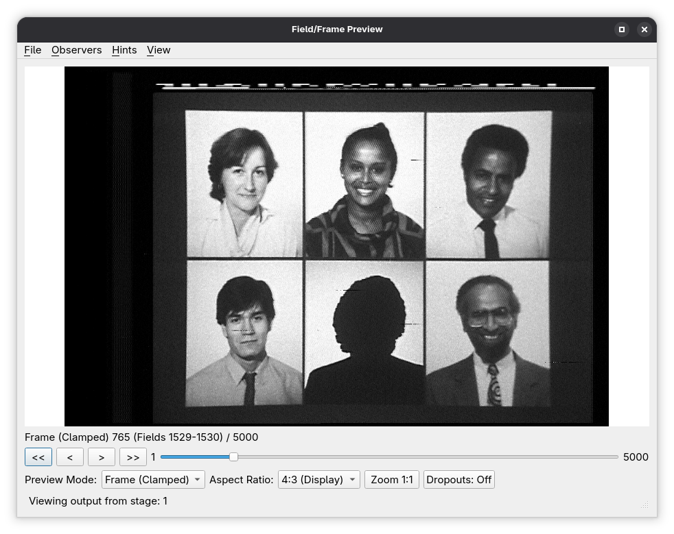

# Preview

The Preview dialogue provides **interactive visual inspection** of data flowing through a decode-orc pipeline. It is not a stage itself, but a **UI tool** that can attach to any stage that exposes preview support.

Previewing is intended for **validation, and tuning**. It allows you to verify timing, field order, signal integrity, and the effects of transform stages before committing to final outputs.

---

## Preview-capable stages

A stage supports preview if it implements the internal preview interface (commonly exposed in code as `PreviewableStage`). Most source stages, all transform stages, and some sinks support preview.

Preview support generally includes:

* Per-field image display
* Field stepping and scrubbing
* Parity (first/second field) indication
* Optional overlays generated by the stage

---

## Core preview features

### Field navigation

The preview dialogue allows navigation through the pipeline output **one field at a time**.

Supported controls include:

* Step forward / backward by field
* Jump to a specific field index
* Continuous playback (where supported)

Field indices always refer to the **post-stage output**, not the original source numbering.

---

### Audio playback

When the previewed stage's output carries audio channel pairs, the preview
dialogue offers an **Audio** selector listing them (plus **Mute/None**),
together with a volume slider. Selecting a pair and pressing play sounds that
pair alongside the advancing preview; choosing **Mute/None** silences it.

Playback is **audio-mastered**: the audio plays continuously at normal speed
and the video chases it. Preview rendering cannot be relied on to reach real
time — a 3D chroma decoder or a neural stage may need seconds per frame — so
the preview shows whichever frame the audio has reached and skips the frames
the renderer could not deliver in time. The sound is always continuous; on a
heavy pipeline the picture simply refreshes at a lower rate.

Points to be aware of:

* Some sources decode their whole audio stream on first access (a TBC source,
  an imported WAV, or an EFM disc decode, which can take minutes). A progress
  window appears when the wait is long enough to notice, and the prepared audio
  is retained so that pausing and resuming is immediate. CVBS containers read
  audio per frame and need no preparation.
* Preparing audio for a TBC, imported or EFM source holds the decoded stream in
  memory, which can reach hundreds of megabytes on a feature-length title.
* Channel-pair numbering belongs to the stage's output, so the selector is
  re-read and reset to **Mute/None** whenever the previewed stage changes.
* Editing parameters or the graph invalidates the prepared audio and stops
  playback; press play again to restart.
* Scrubbing during playback restarts the audio from the new position.
* Choosing **Mute/None** during playback ends the audio session, so the preview
  reverts to its timer-paced video-only playback rather than chasing an audio
  clock. Picking a pair again resumes audio-mastered playback from the position
  reached.
* Projects with no audio are the normal case. The audio controls are then
  disabled and playback behaves exactly as it does without the feature.

---

### Field parity display

The preview UI indicates whether the currently displayed field is:

* First field
* Second field

This is derived from the field parity hints carried through the pipeline and is especially useful when validating:

* Field order correctness
* Alignment after `source_align`

---

### Video scaling and rendering

Preview rendering uses decoded sample data and applies:

* Black and white levels (IRE-based)
* Active video region hints
* Aspect-correct scaling for display

This ensures the preview reflects how downstream sinks will interpret the signal.

---

## Signal analysis tools

The preview's **View** menu opens floating scope dialogues that read the same
frame the preview is showing. Each is a separate window, so a scope can be left
open while parameters upstream of it are adjusted.

| Tool | Shortcut | What it shows |
|------|----------|---------------|
| Frame Timing | Ctrl+Shift+T | Sync and timing waveform across all lines of the current frame. |
| Waveform Monitor | Ctrl+Shift+W | Stacked histogram of sample values across a range of lines. Supported stages only. |
| Vectorscope | Ctrl+Shift+S | U/V chroma scatter on a vectorscope graticule. Available on every stage. |

### Waveform Monitor

| Control | Description |
|---------|-------------|
| Channel | `Y+C (Composite)` accumulates the full composite signal; `Y (Luma only)` uses the separate luma channel when the source has one, and otherwise the composite signal low-pass filtered to remove the colour subcarrier. |
| Range | `Active video` accumulates only the visible part of each line; `Whole frame` includes sync and blanking. |
| Field | `Frame` accumulates both fields together; `Field 1` and `Field 2` accumulate one field only. |
| Phosphor | Draws a green trace on black, in the style of an analogue oscilloscope. |
| Intensity | Brightness gain applied to the accumulated trace. |

The colour subcarrier phase alternates from field to field, so plotting the two
fields separately separates field-correlated interference — subcarrier leakage
into sync, for example — from noise that is random across the frame. The **Field**
selector is disabled when the preview supplies a single field, which has no
second field to compare against.

### Vectorscope

The scope has two acquisitions and does not let you choose between them: the
output being previewed settles which one runs. A chroma decoder's colour output
gives the **decoded (grading)** plot of the U/V planes the decoder produced; a
CVBS or Y/C output gives the **composite (measurement)** plot, demodulated from
the carrier against a burst-locked reference with the burst and both PAL line
phases still in the data set. The Acquisition box reports which is in force.

What the scope takes off the frame is set in two groups, one for each axis of
the raster. Within each group the options are alternatives, so exactly one is in
force at a time.

| Control | Description |
|---------|-------------|
| Line View | Composite only — the decoded planes hold active picture, with no sync, porch or burst to choose between. **Active line** samples the active picture window, **Whole line** the entire line including sync and porches, **Burst only** the colour-burst window on the back porch. |
| Field View | **Active field** (the default) plots the active picture only, which is what the decoded acquisition shows, so the two acquisitions cover the same lines of the frame. **Whole field** plots every line. **Selected line(s)** plots a named range, the way a real instrument's line-select works. |
| Start line / End line | Enabled by **Selected line(s)**. Untick **End line** to plot the start line on its own. The spin boxes only offer lines the plot can show: a frame of the system being plotted (625 for PAL, 525 for NTSC and PAL-M), and — when Field Selection names one field — only that field's lines. |
| Field Selection | Which field (both, first, or second) contributes to the plot. Restricting it to one field also restricts which lines **Selected line(s)** may name. |
| Graticule, Colorize, Defocus, Draw Trace Lines, Gain | Display controls over the plotted trace. |

Line numbers count through the interlaced frame: line 1 is the top line and
consecutive numbers alternate fields — the same numbering the active picture is
stated in — so both acquisitions can be pointed at exactly the same lines.

The burst measurement readouts shown with the composite acquisition are computed
from every active line of the frame: the field view changes what is plotted, not
what is measured, so narrowing the range does not move the readings.

The preview window's **Help → User Guide…** carries the full description of each
control, including the graticule conventions and the burst readouts.

---

## Stage-specific preview behaviour

Some stages augment the preview dialogue with additional behaviour or controls.

### Dropout-related stages

Stages such as `dropout_map` and `dropout_correct` may visually indicate dropout regions.

Examples include:

* Highlighted dropout areas
* White-filled correction regions (when enabled via parameters)

These overlays are generated by the stage and rendered by the preview UI.

---

### Masking stages

For stages such as `mask_line`, the preview will show masked regions directly in the rendered image, allowing immediate verification of:

* Line selection
* Mask sample level

---

### Parameter override stages

Stages such as `video_params` affect how the preview is rendered by changing:

* Active video boundaries
* Black and white levels
* Burst and active region hints

The preview dialogue always reflects the **effective parameters after overrides**, making it a reliable validation tool.

---

## Preview limitations

* Preview is **non-destructive** and has no effect on pipeline output.
* Preview performance depends on stage complexity and pipeline position.
* Some sink stages may not support preview.

---

## Typical preview workflows

Common uses of the preview dialogue include:

* Verifying capture integrity immediately after a source stage
* Checking alignment after `frame_map` and `source_align`
* Tuning `stacker` parameters while observing dropout behaviour
* Validating dropout correction before committing to final output
* Confirming active video and masking settings

---

## Notes on preview usage

* Preview always shows the output of the selected stage.
* When multiple branches exist, each branch can be previewed independently.
* Preview does not bypass or alter pipeline execution.

The Preview dialogue is an essential companion to decode-orc’s stage-based design, providing immediate visual feedback for pipeline construction, debugging, and validation.
